## 삼성 청년 SW 아카데미 (SSAFY) 11기 - 2학기 특화 프로젝트 [B305]

### **1. 프로젝트 개요**

### **1.1 프로젝트 이름**

**NEWZY**

“뉴스(News)"와 "젠지(Gen Z)"를 결합한 것으로, 10대를 포함한 젊은 세대를 위한 맞춤형 뉴스 플랫폼

### **1.2 서비스 목표**

이 프로젝트의 목표는 10대 청소년들이 뉴스를 읽는 습관을 기르고, 시사 상식을 쌓으며 어휘력을 향상시킬 수 있도록 돕는 교육 툴을 개발하는 것입니다.

### **2. 핵심 기능 개요**

1. **회원가입 / 로그인**
    - Google Social Login 만 

2. **어휘력 테스트**
    - 회원가입 시 최초 1회 진행
    - 경제, 사회, 세계 3개의 카테고리에 대한 어휘력 점수 판단
    - 각 분야별로 20개의 단어를 제시 후 유저에게 아는 거 선택받기
    - 1-5 등급으로 구분
    - 추천 알고리즘의 초기 값으로 설정

3. **실시간 어휘 검색**
    - 우리말샘 API를 이용
    - 뉴스 기사 내에서 모르는 단어를 검색하면 해당 단어를 실시간으로 알려주는 기능

4. **나만의 단어장**
    - 유저가 검색한 단어들을 모아 조회, 삭제할 수 있는 단어장 기능
    <div align="center">
        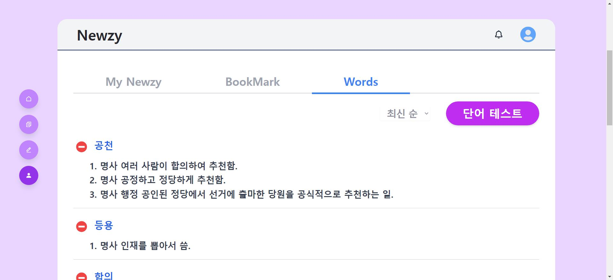
    </div>
    <br>

    - 단어장에 등록된 단어로 단어 테스트 가능
    <div align="center">
        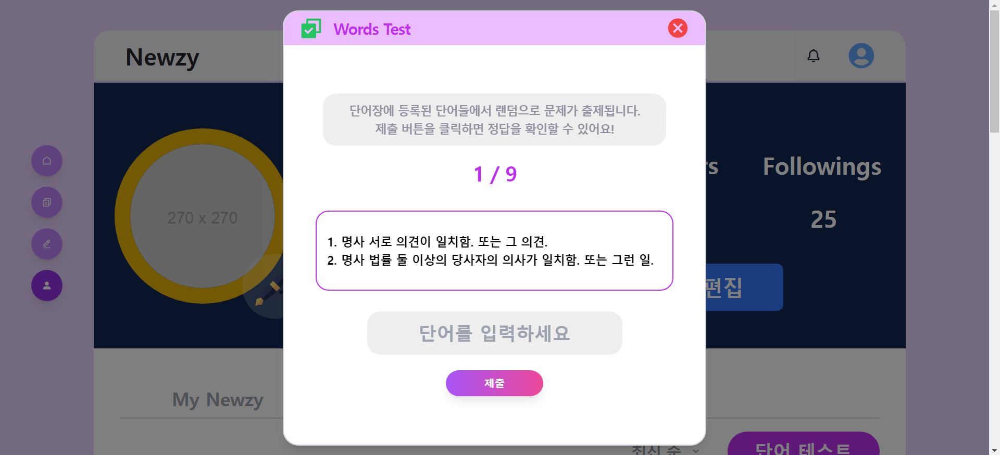
    </div>
    <div align="center">
        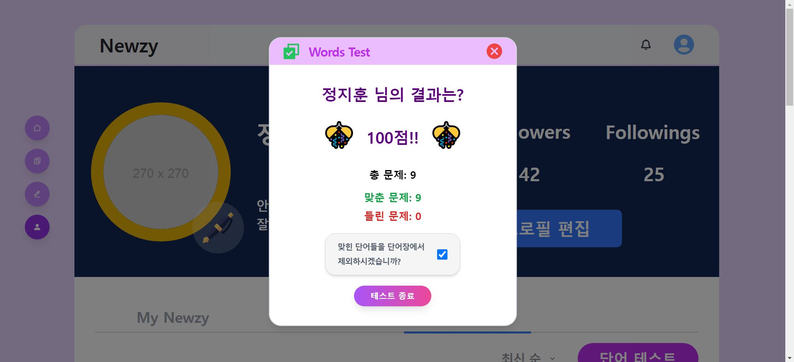
    </div>
    <br>

5. **카드리스트 - 뉴스 요약**
    - 서드파티 API를 이용
    - 같은 뉴스에 대해 다양한 방식으로 요약된 카드들을 제공
    - 군집 기반 요약

6. **카드 리스트 - 뉴스 읽기 보상**
    - 유저가 읽은 뉴스에 대해 카드 아이템을 획득할 수 있는 기능
    - 획득 조건: 뉴스를 읽고 난이도 평가 및 직접 요약 작성 시 획득

7. **뉴스 난이도 평가**
    - 유저가 다 읽은 뉴스에 대해 난이도를 평가(쉬워요/평이해요/어려워요)할 수 있는 기능
    - 유저의 어휘력 수준에 반영

8. **뉴스 스크랩/좋아요**
    - 유저가 관심 있는 뉴스를 스크랩하거나 좋아요를 눌러 저장할 수 있는 기능
    - 좋아요는 추천 알고리즘에 반영

9. **내가 쓰는 기사 - 뉴지**
    <br>
    <div align="center">
        [front-end]
    <div/>
    <div align="center">
        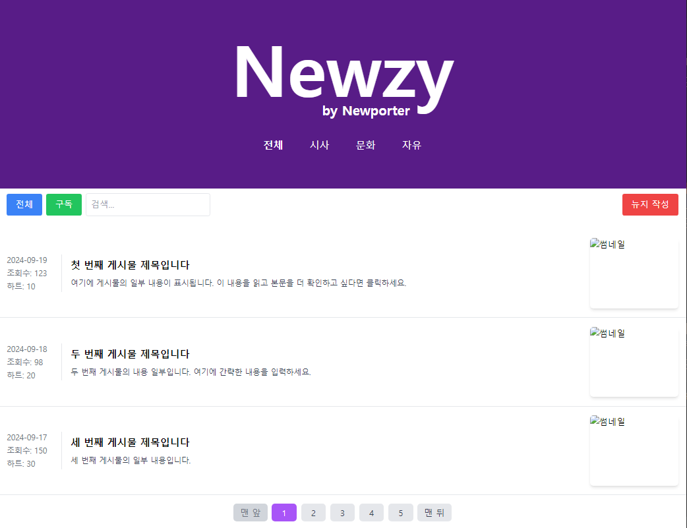
    </div>
    <div align="center">
        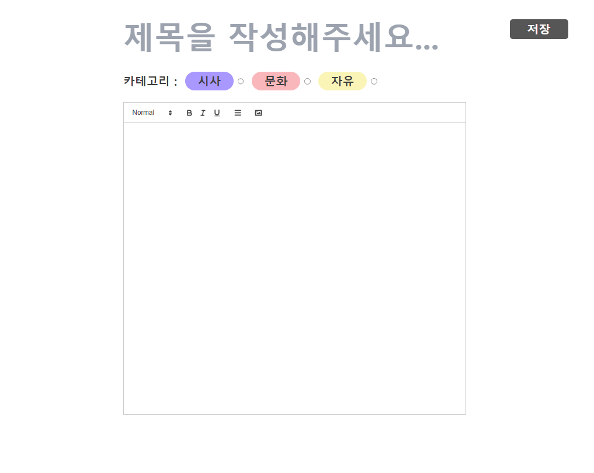
    </div>
    <div align="center">
        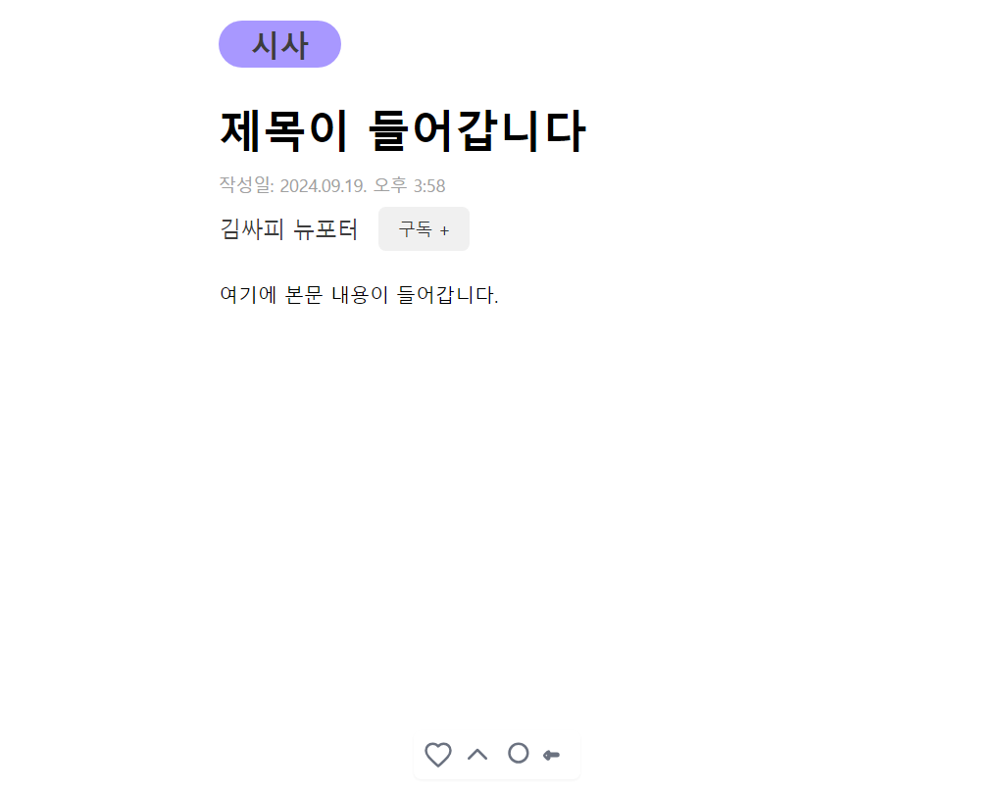
    </div>
    <br>
    <div align="center">
        [back-end]
    <div/>
    <div align="center">
        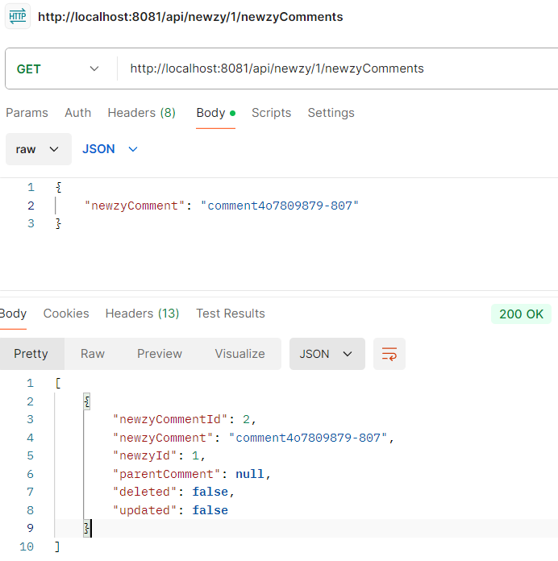
        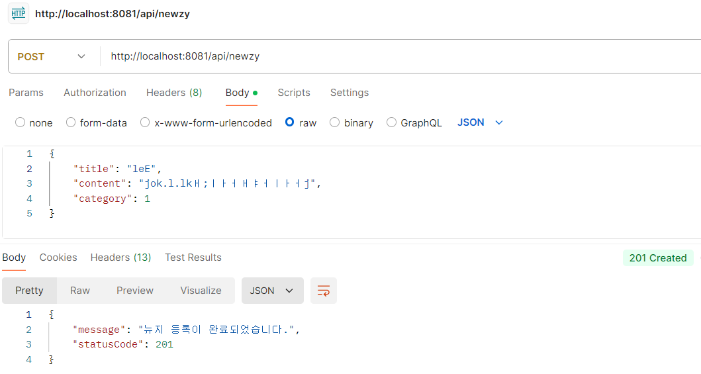
    </div>
    - 사용자가 직접 작성한 기사를 메인 페이지에 배치(진짜 기사와는 구별)
    <br>
    - 다른 사용자들과 공유하고 소통하는 기능

10. **워드 클라우드**
    - 최근 3일동안 사용자가 검색한 단어를 워드클라우드를 이용해 보여줌
    - 캐싱을 위한 Redis 사용
    
### **3. 구현 계획**

### **3.1** 데이터

1. **데이터 저장소 선정**
    - MySQL: 정형 데이터 관리
    <div align="center">
        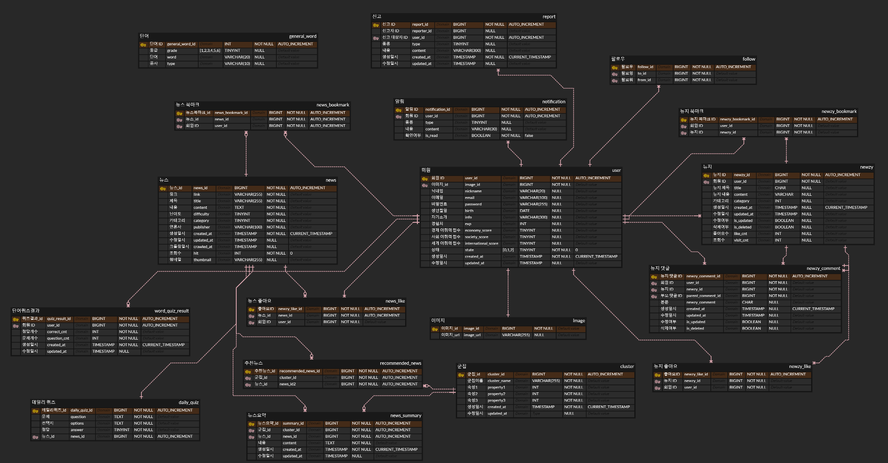
    </div>
    - MongoDB: 비정형 데이터 관리
    <div align="center">
        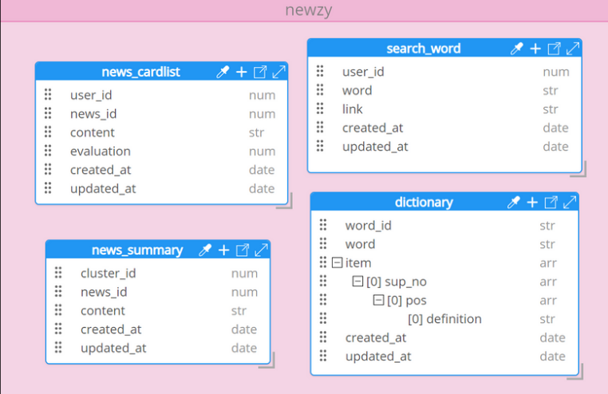
    </div>
    - Redis: 캐싱을 위해 사용 
        - 랭킹 및 워드 클라우드 저장

2. **DB 설계 및 시스템 아키텍처 구성**
    - 무중단배포, 로드밸런싱 적용한 아키텍처 설계

3. **데이터 크롤링 및 전처리**
    - 뉴스 데이터를 크롤링하여 전처리하는 과정
    - 경제, 사회, 세계 3개의 카테고리에 대해 각 3개씩 언론사를 선정 (하단 참조)
    - 배치 작업시마다 랜덤 샘플링을 적용하여 최대 90개의 뉴스 획득 가능

4. **뉴스 분석**
    - 수집된 뉴스 데이터를 분석하는 과정
    - 뉴스에 포함된 단어의 난이도를 기반으로 하여 1-5등급으로 난이도 평가

5. **유저 로그 수집**
    - 좋아요 및 페이지 체류 시간 등의 유저 활동 로그를 수집

6. **유저 로그 분석 및 뉴스 추천**
    - 수집된 유저 로그를 분석하여 뉴스 추천 시스템 구성

### **3.2** 뉴스 분야
- **뉴스 소스**
    - 경제: [매일경제](https://www.mk.co.kr/news/economy/), [한국경제](https://www.hankyung.com/economy), [머니투데이](https://news.mt.co.kr/newsList.html?pDepth1=politics&pDepth2=Ptotal)
    - 사회: [연합뉴스](https://www.yna.co.kr/society/all/), [YTN](https://www.ytn.co.kr/news/list.php?mcd=0103), [채널A](https://www.ichannela.com/news/main/news_part.do?catecode=000404)
    - 세계: [뉴시스](https://www.newsis.com/world/list/?cid=10100&scid=10101), [세계일보](https://segye.com/newsList/0101040100000), [SBS BIZ](https://biz.sbs.co.kr/news/list.html?menu=j1_8)

### **3.3** 프론트엔드

1. **FSD(Feature-Sliced Design) 아키텍처**
    - 기능을 중심으로 UI, 로직, 상태 관리를 모듈화하여 구성

2. **폴더 구조**

```
📦src
 ┣ 📂app
 ┃ ┣ 📂layout
 ┃ ┣ 📂routers
 ┃ ┗ 📜App.jsx
 ┣ 📂entities
 ┣ 📂features
 ┣ 📂pages
 ┃ ┣ 📂home
 ┃ ┣ 📂newsDetail
 ┃ ┣ 📂newsList
 ┃ ┣ 📂newzyDetail
 ┃ ┣ 📂newzyEdit
 ┃ ┣ 📂newzyList
 ┃ ┗ 📂profile
 ┣ 📂shared
 ┃ ┣ 📂api
 ┃ ┣ 📂images
 ┃ ┣ 📂utils
 ┃ ┣ 📜getGrade.js
 ┃ ┗ 📜index.js
 ┣ 📂widgets
 ┃ ┣ 📂footer
 ┃ ┣ 📂header
 ┃ ┣ 📂profilePage
 ┃ ┗ 📂sidebar
 ┣ 📜main.css
 ┗ 📜main.jsx
```

3. **폴더 설명**

| 폴더명명 | 폴더 설명 |
| --- | --- |
| app | 최상단 레이어로 앱의 로직이 초기화되는 곳 |
| entities | 프로젝트가 다루는 비즈니스 엔티티 (예를 들어, 유저, 댓글 등) |
| features | 제품 전반에 걸쳐 재사용되는 기능 구현체로, 사용자에게 실질적인 비즈니스 가치를 제공하는 동작(예를 들어, 좋아요, 리뷰작성,등) |
| pages | 전체 페이지 또는 중첩 라우팅에서 페이지의 주요 부분 |
| shared | 범용적으로 사용되는 재사용가능한 컴포넌트와 유틸리티를 포함하는 레이어 |
| widgets | 독립적으로 작동하는 대규모 기능 또는 UI 컴포넌트 |

### **3.4** 백엔드
1. **폴더 구조**
    <div>
        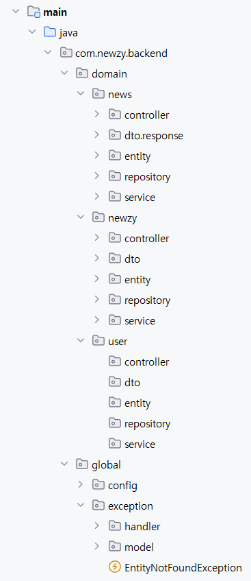
    </div>
